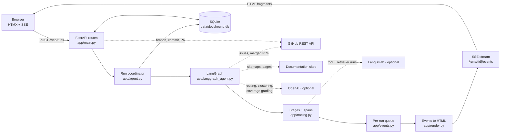
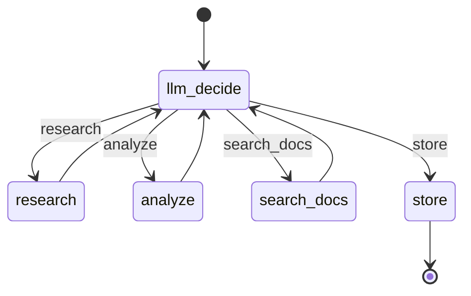
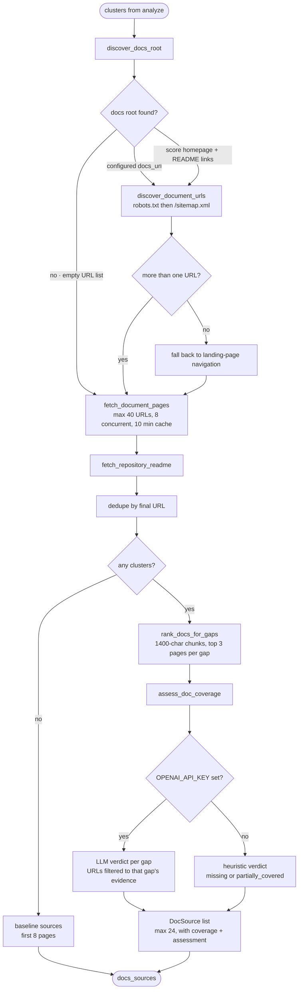
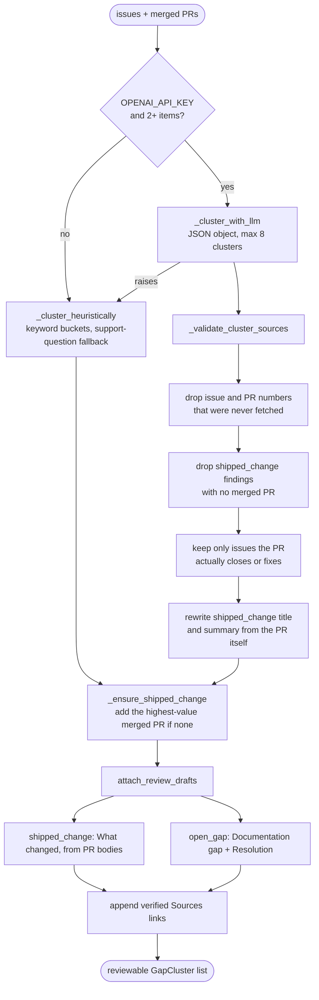
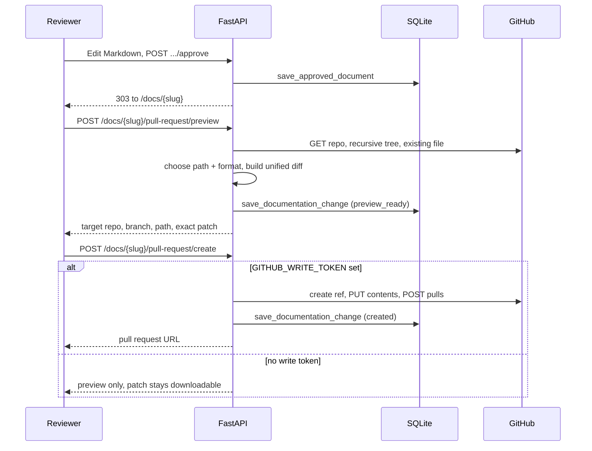
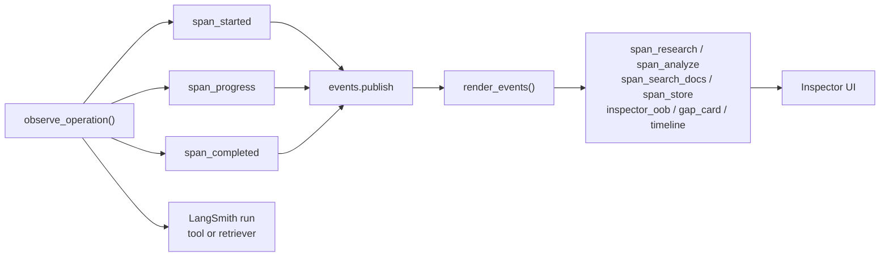

# DocsHound

<p align="center">
  
</p>

<p align="center">
  <a href="https://github.com/MatthewFeroz/docshound/actions/workflows/ci.yml"></a>
  
  <a href="LICENSE"></a>
</p>

DocsHound turns open issues and merged pull requests into grounded, reviewable
documentation updates.

It is a LangGraph agent behind a FastAPI + HTMX application. Point it at a public
repository and it will:

1. Collect recent issues and merged pull requests independently.
2. Separate unresolved documentation gaps from shipped changes.
3. Discover the project's real documentation site and assess whether each gap is
   already covered.
4. Draft Markdown grounded in the linked repository evidence.
5. Let a human edit and approve the document.
6. Detect the target documentation layout and prepare Markdown or MDX.
7. Preview the exact repository patch.
8. Create a documentation branch, commit, and pull request when write access is
   connected.

Every step streams to the browser as it happens, and every operation is traced
locally — and to LangSmith when it is enabled.

## Architecture



The browser never polls for run state. `POST /web/runs` returns the inspector
shell, then the agent pushes pre-rendered HTML fragments over one SSE connection.

## The agent graph

The graph is a ReAct-style router loop. `llm_decide` picks the next action, every
worker node returns to the router, and only `store` exits.



Routing is model-proposed but **not** model-controlled. `_safe_next_action`
computes the deterministically correct next step from completed-stage flags, and
`_guard_action` overrides the model whenever it disagrees:

| Situation | Result |
| --- | --- |
| No `OPENAI_API_KEY` | Deterministic fallback router, recorded as such |
| Model call raises | Deterministic fallback router, error kept in the reason |
| Model picks a different action | Guardrail wins, both choices recorded |
| Model picks `store` while errors exist | Model wins, the run ends early |

Every decision is appended to `state["decisions"]` and published as an
`agent_decision` event, so the audit trail shows what the model wanted and what
actually ran.

### Nodes and operations

Each stage owns a set of traced operations, defined in `OPERATION_SPECS` in
`app/tracing.py`. Spans nest by `parent_span_id` and `depth`.

```text
research
├── research_repo                 GET /repos/{repo}/issues, state=all, sort=updated
└── research_pull_requests        GET /repos/{repo}/pulls, closed + merged_at only

analyze
├── cluster_issues                LLM clustering, validated, heuristic fallback
└── draft_findings                Grounded Markdown per cluster

search_docs
└── search_official_docs
    ├── discover_docs_root        homepage + README link scoring
    ├── discover_document_urls    robots.txt, sitemaps, then nav fallback
    ├── fetch_document_pages      [retriever] bounded concurrent fetch
    ├── fetch_repository_readme   [retriever] first-party fallback evidence
    ├── rank_docs_for_gaps        chunk + score excerpts per gap
    └── assess_doc_coverage       covered / partially_covered / missing

store
└── (no operations; finalizes state and the audit trail)
```

`fetch_document_pages` and `fetch_repository_readme` are traced as LangSmith
`retriever` runs, so retrieved pages show up as documents rather than opaque tool
output.

## Documentation coverage pipeline

`search_docs` is the deepest part of the agent. It finds the project's real docs
site, retrieves a bounded corpus, and grades each gap against cited excerpts.



Safety and scope rules that are enforced in code, not prompts:

- Retrieval is SSRF-guarded. `_normalize_public_url` rejects non-HTTP schemes,
  `localhost`, and private, loopback, link-local, or reserved IPs.
- Crawling stays inside the docs root's origin and path scope, and skips other
  locales once a root locale is detected.
- The coverage prompt marks excerpts as untrusted evidence, and returned
  `source_urls` are filtered to URLs that were actually supplied for that gap.
- A gap with no retrieved excerpt is forced to `missing`, whatever the model says.

## Clustering and drafting

`app/tools/cluster.py` is where model output gets constrained back to evidence.



Findings come in two kinds:

- **`open_gap`** — recurring questions with no confirmed answer. If the issues do
  not establish a resolution, the draft says what still needs verification rather
  than inventing steps.
- **`shipped_change`** — a merged pull request whose user-facing behavior needs
  explaining. Title, summary, and resolution are rebuilt from the PR, so the model
  cannot attribute a change to a PR that did not ship it.

## Review to pull request



Target detection reads the repository tree and picks a destination:

| Detected | Destination | Format |
| --- | --- | --- |
| `docs.json` or `mint.json` | first existing `guides/`, `documentation/`, or `reference/` beside the config, else `guides/` | MDX + frontmatter |
| `docusaurus.config.*` | `docs/` beside the config | MDX + frontmatter |
| `mkdocs.yml` / `mkdocs.yaml` | `docs/` beside the config | Markdown |
| existing `docs/` | `docs/` | Markdown |
| existing `documentation/` | `documentation/` | Markdown |
| nothing detected | `docs/` | Markdown |

The repository and path can both be overridden during review. Branch creation,
commits, and PR creation are idempotent: an existing branch is reused, an
unchanged file is not recommitted, and a `422` on PR creation falls back to
returning the open pull request.

## Observability

Two audiences, one instrumentation layer in `app/tracing.py`.



- **Stages** — `stage_started` / `stage_completed` carry a label, status, detail,
  and wall-clock `duration_ms`.
- **Spans** — `observe_operation` emits `span_started`, optional `span_progress`,
  and `span_completed` with input summary, output summary, duration, and error.
  Span identity is shared with LangSmith: the same UUID is the local `span_id` and
  the LangSmith `run_id`, so a row in the UI maps to one trace run.
- **Progress** — long operations call `publish_span_progress`, which reads the
  active span from a `ContextVar`, so nothing has to thread IDs through call sites.
- **Streaming** — `render_events` turns each event into an HTMX out-of-band swap
  on a named SSE channel. `GET /runs/{id}/events` serves HTML; `GET
  /runs/{id}/events.json` serves the raw JSON events for scripting and tests.

LangSmith tracing is optional. Add the standard variables to `.env` to enable it:

```text
LANGSMITH_TRACING=true
LANGSMITH_API_KEY=
LANGSMITH_PROJECT=docshound
```

Without them nothing is sent to LangSmith and the local inspector keeps working
unchanged.

## Run locally

Requires Python 3.11 or newer.

```bash
python -m venv .venv
source .venv/bin/activate
pip install -r requirements.txt
cp .env.example .env
./run.sh
```

Open [http://127.0.0.1:8000](http://127.0.0.1:8000).

You can also start the server directly:

```bash
.venv/bin/uvicorn app.main:app --reload --host 127.0.0.1 --port 8000
```

The graph is also registered for LangGraph tooling in `langgraph.json` as
`docshound` → `./app/langgraph_agent.py:graph`, so it can be run in LangGraph
Studio with `langgraph dev`.

## Configuration

Public repositories work without credentials for small runs. Add these values to
`.env` as needed:

```text
APP_ENV=development
GITHUB_TOKEN=          # optional: higher read limits
GITHUB_WRITE_TOKEN=    # optional: create documentation branches and PRs
OPENAI_API_KEY=        # optional: model routing, clustering, coverage grading
OPENAI_MODEL=gpt-4o-mini
```

What each optional key changes:

| Key | Unset | Set |
| --- | --- | --- |
| `GITHUB_TOKEN` | Unauthenticated reads, low rate limit | Higher read limits |
| `OPENAI_API_KEY` | Deterministic router, keyword clustering, heuristic coverage | LLM routing, clustering, and coverage grading, all guardrailed |
| `GITHUB_WRITE_TOKEN` | Review, detection, patch preview, and download | Branch, commit, and pull-request creation |

For pull-request creation, use a fine-grained write token limited to the target
documentation repositories with:

- Contents: read and write
- Pull requests: read and write

## HTTP interface

| Method | Path | Purpose |
| --- | --- | --- |
| `GET` | `/health` | Liveness check |
| `GET` | `/` | Landing page and run form |
| `POST` | `/web/runs` | Start a run, return the inspector panel |
| `POST` | `/runs` | Start a run, return `{"run_id": ...}` |
| `GET` | `/runs/{run_id}` | Run snapshot as JSON |
| `GET` | `/runs/{run_id}/events` | SSE stream of rendered HTML fragments |
| `GET` | `/runs/{run_id}/events.json` | SSE stream of raw JSON events |
| `GET` | `/findings` | Every finding across persisted runs |
| `GET` | `/runs/{run_id}/gaps/{index}` | Finding review page |
| `POST` | `/runs/{run_id}/gaps/{index}/approve` | Save the edited Markdown |
| `POST` | `/runs/{run_id}/gaps/{index}/reject` | Mark a finding rejected |
| `GET` | `/docs/{slug}` | Approved standalone document |
| `GET` | `/docs/{slug}/download` | Download the document as `.md` |
| `POST` | `/docs/{slug}/pull-request/preview` | Detect target and build the patch |
| `GET` | `/docs/{slug}/pull-request` | Prepared change and patch preview |
| `POST` | `/docs/{slug}/pull-request/create` | Create branch, commit, and PR |
| `GET` | `/docs/{slug}/pull-request/patch` | Download the `.patch` |

Start a run:

```bash
curl -sS -X POST http://127.0.0.1:8000/runs \
  -H 'Content-Type: application/json' \
  -d '{"repo":"GoogleCloudPlatform/knowledge-catalog","limit":50}'
```

Then poll the returned run ID:

```bash
curl -sS http://127.0.0.1:8000/runs/<RUN_ID> | jq
```

Or follow the run as it happens:

```bash
curl -N http://127.0.0.1:8000/runs/<RUN_ID>/events.json
```

`limit` accepts 1–100 and bounds issue collection; merged PR collection is capped
independently at 30. `dry_run` is accepted and recorded as run metadata, but write
access is gated solely by `GITHUB_WRITE_TOKEN` — nothing is written to a
repository without it.

The browser workflow is usually simpler: enter `owner/repository`, watch the
inspector, open a finding, edit the Markdown, and approve it.

## Operational limits

Bounded so a run cannot walk a whole documentation site:

| Limit | Value | Location |
| --- | --- | --- |
| Issues per run | `limit`, 1–100 | `app/tools/github.py` |
| Merged PRs per run | `min(limit, 30)` | `app/tools/github.py` |
| Clusters per run | 8 | `app/tools/cluster.py` |
| Documentation URLs | 40 | `MAX_DOCUMENT_URLS` |
| Sitemaps followed | 8 | `MAX_SITEMAPS` |
| Concurrent page fetches | 8 | `fetch_document_pages` |
| Page cache TTL | 600 s | `PAGE_CACHE_TTL_SECONDS` |
| Chunk size / overlap | 1400 / 180 chars | `chunk_document` |
| Ranked pages per gap | 3 | `rank_chunks_for_gaps` |
| Returned sources | 24 | `MAX_RETURNED_SOURCES` |

## Persistence

Local state lives in `data/docshound.db`, which is ignored by Git. Tables are
created on first connection.

```text
runs                    run_id, repo, status, state_json, updated_at
approved_documents      slug, run_id, gap_index, repo, title, summary,
                        markdown, source_issues_json, timestamps
                        unique(run_id, gap_index)
documentation_changes   document_slug, target_repo, base_branch, branch_name,
                        file_path, file_format, detected_by, content, patch,
                        existing_sha, status, pr_number, pr_url, error
```

Completed runs are reloaded into memory on startup, so findings and the review
workflow survive server restarts.

## Tests

```bash
.venv/bin/python -m unittest discover -s tests -v
```

| File | Covers |
| --- | --- |
| `tests/test_docs_search.py` | Sitemap parsing, docs scope and locale filtering, navigation fallback, per-gap ranking, cited coverage output |
| `tests/test_observability.py` | Span start / progress / completion linkage, stage and span rendering, SSE channel targeting |
| `tests/test_documentation_flow.py` | MDX repository detection, patch generation, branch → commit → PR sequence, run persistence round-trip |

## Project structure

```text
app/
  main.py                  FastAPI routes, SSE endpoints, review actions
  agent.py                 run coordinator, graph invocation, persistence
  langgraph_agent.py       graph state, nodes, router, guardrails
  state.py                 Pydantic models and the in-memory run registry
  config.py                environment-backed settings
  tracing.py               stage and span instrumentation, LangSmith spans
  events.py                per-run async event queue
  render.py                events to HTMX fragments
  approved_documents.py    approved Markdown persistence and sanitized render
  documentation_prs.py     target detection, patches, branch and PR creation
  run_store.py             persistent run storage
  tools/
    github.py              issue and merged pull request collection
    cluster.py             LLM clustering, validation, heuristic fallback, drafts
    docs.py                coverage pipeline orchestration and assessment
    docs_discovery.py      docs root discovery, sitemap crawl, page extraction
    docs_retrieval.py      chunking, scoring, and per-gap ranking
  web/
    templates/             pages and HTMX partials, including the inspector
    static/                stylesheet and logos
tests/
  test_docs_search.py
  test_observability.py
  test_documentation_flow.py
```

## Development

Linting and formatting use [Ruff](https://docs.astral.sh/ruff/):

```bash
ruff check app tests
ruff format --check app tests
```

GitHub Actions runs the test suite on Python 3.11 and 3.12, plus the lint and
format checks, on every push to `main` and every pull request.

## License

Released under the [MIT License](LICENSE).
